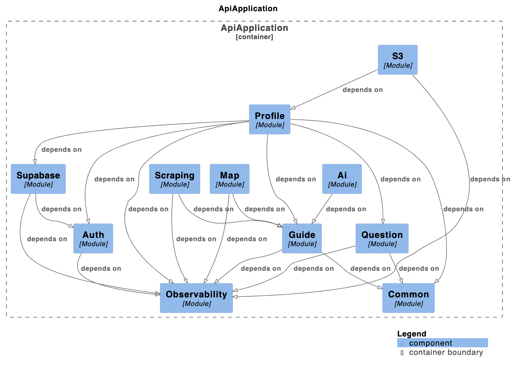

# Book API Challenge

It's a Spring Boot API that lets Airbnb hosts generate, translate, and maintain guest guides in any language with the help of AI instead of hand-crafting every section.
The goal of this challenge was to create an API ready for pre-production, not just a demo.

## What this API offers
- Create housings and multilingual guides, auto-populate them from an Airbnb listing, and enrich them with nearby recommendations pulled from Google Places.
- Simplifies content creation and translation using AI (via Spring AI) so that each guide remains consistent, localized, and easy to regenerate.
- Persist assets such as avatars or guide media in S3 while exposing public URLs tuned for the active environment (dev vs prod buckets).
- Secure every private route with Supabase. Implements OTP/refresh flows, and request throttling so guests can only see the guides you share via a public slug.
- Integration tests covering the main workflows, using Testcontainers. I deliberately avoided spending time on unit tests where it matters less (for this challenge). 

## Project architecture
- Kind of Hexagonal Architecture with the DDD and SPI Patterns. Controllers still in the core of each module for simplicity, but domain services depend only on their SPI interfaces.
- Metrics, traces, and logs are exported through Micrometer OTLP + OpenTelemetry. In practice this was tested end-to-end with [SigNoz](https://signoz.io/).



## Authentication & external services
- Supabase as the identity provider: OTP, verification, refresh, and phone-based flows.
- Rate limiting with Bucket4j
- Google Places API
- S3 storage testes with Cloudflare R2
- Custom Airbnb scraping

## How to run the project ?
1. Create a .env file from the provided .env.example
2. Run
```shell
docker compose up -d
```
3. Go to http://localhost:5000/swagger-ui/index.html to explore the API

## License
THis project is Open Source software released under the [Apache 2.0 license.](https://www.apache.org/licenses/LICENSE-2.0.html)